  <picture>
    <source media="(prefers-color-scheme: dark)" srcset="assets/terrain-dark.svg">
    
  </picture>

 

  <picture>
    <source media="(prefers-color-scheme: dark)" srcset="assets/portrait-dark.svg">
    
  </picture>
  <a href="https://github.com/Sepd0x/marco-polo">
    <picture>
      <source media="(prefers-color-scheme: dark)" srcset="assets/marco-polo-dark.svg">
      
    </picture>
  </a>

